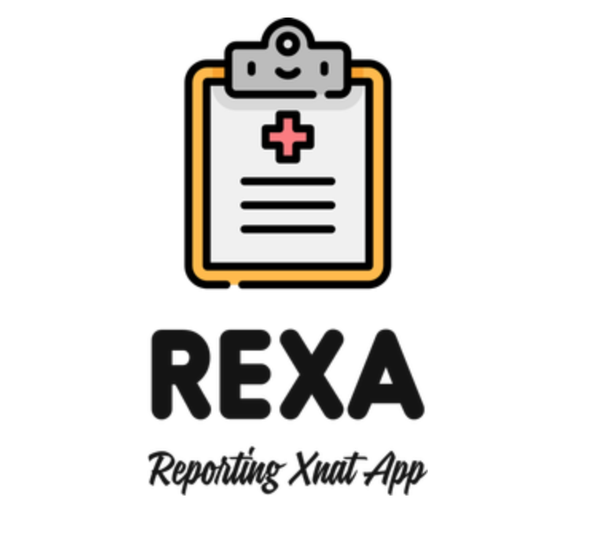

# REXA

Reporting Xnat App is a Spring Boot / React web application to visually report data from XNAT. Part of the project report
is based on the [Dax python package](https://github.com/VUIIS/dax) developped at Vanderbilt University in Nashville, Tennessee.

# Database migration

To manage our schema we are using Flyway. You can find more about it [here](https://flywaydb.org/).

To clean the database :
`mvn clean compile flyway:clean`

To run the migration, you can run the following command : 
`mvn clean compile flyway:migrate`

# Stack

The stack is the following one:

- SpringBoot and Kotlin for the back with OAuth2
- Postgresql 12 to host our data and access it via JooQ.
- React for the front

# Testing

You should use the docker-compose in [here](https://github.com/yvbro/xnat-docker-compose) to launch a proper XNAT. 

Mocked data are available in [this project](https://github.com/yvbro/mockData).

Follow the instructions on the different projects to get a setup to develop on ReXA.
